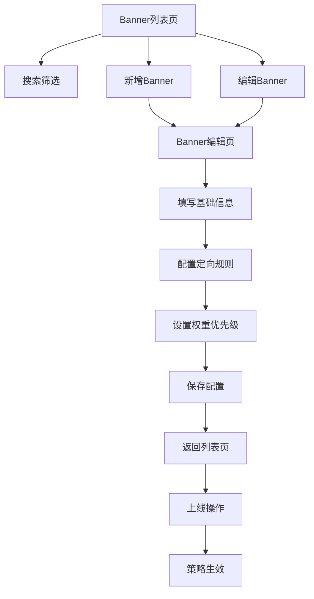

## 1. 产品概述
Banner策略管理后台是一个用于管理网站/APP首页轮播图和广告位的配置系统。通过可视化的界面，运营人员可以灵活配置不同渠道、城市、用户类型的展示内容，实现精准投放和策略管理。

核心价值：提升运营效率，实现千人千面的内容展示，支持精细化运营策略。

## 2. 核心功能

### 2.1 用户角色
| 角色 | 注册方式 | 核心权限 |
|------|----------|----------|
| 超级管理员 | 后台创建 | 所有功能权限，包括用户管理 |
| 运营人员 | 管理员创建 | Banner管理、策略配置、数据查看 |
| 审核人员 | 管理员创建 | 内容审核、上线/下线操作 |

### 2.2 功能模块
Banner策略管理后台包含以下核心页面：
1. **Banner列表页**：展示所有Banner配置，支持搜索筛选和批量操作
2. **Banner编辑页**：新增/编辑Banner信息，配置展示规则和策略
3. **策略配置页**：管理优先级权重和兜底策略设置

### 2.3 页面详情
| 页面名称 | 模块名称 | 功能描述 |
|----------|----------|----------|
| Banner列表页 | 搜索筛选区 | 输入关键字搜索、选择开始/结束时间、重置筛选条件 |
| Banner列表页 | 数据表格 | 展示序号、标题、位置、创建时间、更新时间、状态、权重、操作按钮 |
| Banner列表页 | 操作按钮 | 查看详情、编辑、上线、下线、删除、复制配置 |
| Banner列表页 | 批量操作 | 批量上线、批量下线、批量删除、导出数据 |
| Banner编辑页 | 基础信息 | 填写标题、选择展示位置、上传图片、设置跳转链接 |
| Banner编辑页 | 时间配置 | 设置开始时间、结束时间，校验时间合法性 |
| Banner编辑页 | 定向规则 | 选择渠道(Android/iOS/H5)、选择城市/站点、选择用户类型(新/老用户)、选择登录状态 |
| Banner编辑页 | 高级配置 | 设置权重优先级、添加备注信息、选择上下线状态 |
| 策略配置页 | 优先级管理 | 调整不同Banner的权重数值，数值越大优先级越高 |
| 策略配置页 | 兜底策略 | 配置默认展示图片，当无匹配策略时显示 |

## 3. 核心流程

### 运营人员操作流程
1. 登录后台系统，进入Banner列表页
2. 通过搜索筛选找到目标Banner，或点击"新增"创建新Banner
3. 在编辑页填写基础信息，上传图片，配置跳转链接
4. 设置展示时间范围和定向规则（渠道、城市、用户类型）
5. 配置权重优先级，保存并提交审核
6. 审核通过后，执行上线操作

### 策略匹配流程
系统根据用户访问时的参数（渠道、城市、用户类型、登录状态、当前时间）进行策略匹配：
- 首先匹配精确条件（城市+渠道+用户类型+登录状态）
- 逐步放宽条件维度进行模糊匹配
- 最终无匹配时展示兜底图片

## 4. 用户界面设计

### 4.1 设计风格
- **主色调**：蓝色（#1890ff）为主要操作色，红色（#ff4d4f）为警告色
- **按钮样式**：圆角矩形，主要操作为蓝色填充，次要操作为灰色边框
- **字体规范**：系统默认字体，标题16px，正文14px，辅助文字12px
- **布局风格**：左侧导航菜单 + 右侧内容区域，卡片式表单设计
- **图标风格**：使用Ant Design官方图标库，线性风格

### 4.2 页面设计概览
| 页面名称 | 模块名称 | UI元素 |
|----------|----------|--------|
| Banner列表页 | 搜索区域 | 白色背景搜索框，蓝色搜索按钮，灰色重置按钮，时间选择器使用日期范围组件 |
| Banner列表页 | 数据表格 | 条纹状表格行，操作列包含多个蓝色文字按钮，状态标签使用绿色/灰色区分 |
| Banner列表页 | 批量操作 | 顶部蓝色"新增"按钮，灰色批量操作下拉菜单，导出按钮 |
| Banner编辑页 | 表单区域 | 白色卡片容器，左对齐标签，必填项红色星号标记，图片上传显示预览图 |
| Banner编辑页 | 操作按钮 | 底部右侧蓝色"保存"按钮，灰色"取消"按钮 |
| 策略配置页 | 权重设置 | 数字输入框，支持拖拽排序，实时显示优先级顺序 |

### 4.3 响应式设计
- **设计原则**：桌面端优先，适配平板和手机端
- **断点设置**：1200px（桌面）、768px（平板）、375px（手机）
- **适配策略**：
  - 桌面端：完整展示所有功能
  - 平板端：侧边栏收起，表格横向滚动
  - 手机端：简化表格为卡片式列表，操作按钮聚合