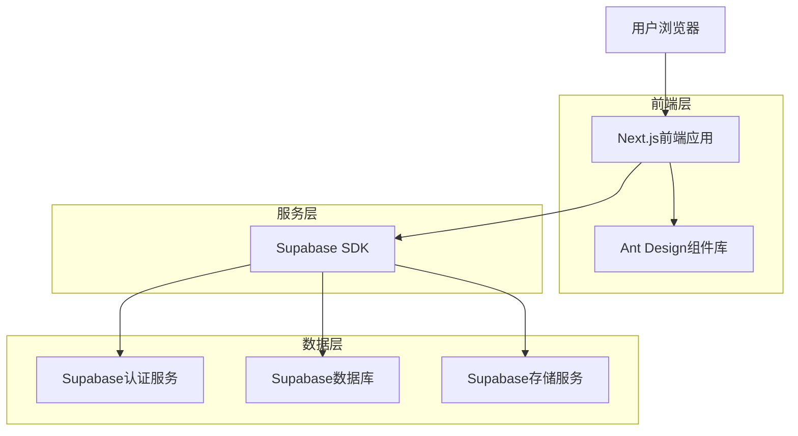
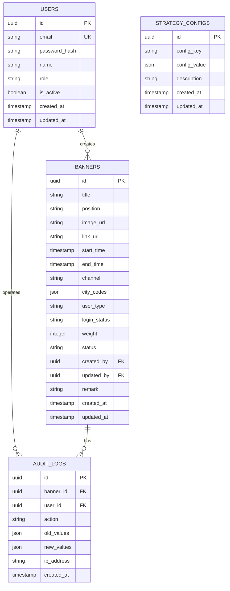

## 1. 架构设计



## 2. 技术描述

- **前端框架**：Next.js 14 (App Router) + React 18
- **UI组件库**：Ant Design 5.x
- **样式方案**：Tailwind CSS 3.x
- **状态管理**：React Context + SWR
- **后端服务**：Supabase (BaaS)
- **数据库**：PostgreSQL (通过Supabase)
- **文件存储**：Supabase Storage
- **初始化工具**：create-next-app

## 3. 路由定义

| 路由路径 | 页面用途 |
|----------|----------|
| / | Banner列表页，展示所有Banner配置 |
| /login | 登录页，用户身份验证 |
| /banners/new | 新增Banner页，创建新的Banner配置 |
| /banners/[id]/edit | 编辑Banner页，修改现有Banner配置 |
| /banners/[id] | Banner详情页，查看配置详情 |
| /strategy | 策略配置页，管理优先级和兜底策略 |
| /audit | 审核管理页，处理待审核的Banner |

## 4. API定义

### 4.1 Banner管理API

**获取Banner列表**
```
GET /api/banners
```

请求参数：
| 参数名 | 参数类型 | 是否必需 | 描述 |
|--------|----------|----------|------|
| keyword | string | false | 搜索关键字 |
| start_date | string | false | 开始时间(ISO格式) |
| end_date | string | false | 结束时间(ISO格式) |
| status | string | false | 状态筛选 |
| page | number | false | 页码，默认1 |
| page_size | number | false | 每页条数，默认20 |

响应数据：
```json
{
  "data": [
    {
      "id": "banner_001",
      "title": "春节促销活动",
      "position": "homepage_top",
      "image_url": "https://example.com/image.jpg",
      "link_url": "https://example.com/promo",
      "start_time": "2024-02-01T00:00:00Z",
      "end_time": "2024-02-15T23:59:59Z",
      "channel": "android",
      "city_codes": ["110000", "310000"],
      "user_type": "new",
      "login_status": "logged_in",
      "weight": 100,
      "status": "online",
      "created_at": "2024-01-20T10:00:00Z",
      "updated_at": "2024-01-25T15:30:00Z"
    }
  ],
  "total": 50,
  "page": 1,
  "page_size": 20
}
```

**创建Banner**
```
POST /api/banners
```

请求体：
```json
{
  "title": "新品上市",
  "position": "homepage_banner",
  "image_file": "File对象",
  "link_url": "https://example.com/new",
  "start_time": "2024-03-01T00:00:00Z",
  "end_time": "2024-03-31T23:59:59Z",
  "channel": "ios",
  "city_codes": ["all"],
  "user_type": "all",
  "login_status": "all",
  "weight": 80,
  "remark": "春季新品推广"
}
```

**更新Banner状态**
```
PUT /api/banners/{id}/status
```

请求体：
```json
{
  "status": "online"
}
```

### 4.2 策略匹配API

**获取展示Banner**
```
GET /api/banners/display
```

请求参数：
| 参数名 | 参数类型 | 是否必需 | 描述 |
|--------|----------|----------|------|
| position | string | true | 展示位置 |
| channel | string | true | 渠道类型 |
| city_code | string | true | 城市编码 |
| user_type | string | true | 用户类型 |
| login_status | string | true | 登录状态 |

## 5. 数据模型

### 5.1 数据库表结构



### 5.2 数据定义语言

**用户表**
```sql
CREATE TABLE users (
    id UUID PRIMARY KEY DEFAULT gen_random_uuid(),
    email VARCHAR(255) UNIQUE NOT NULL,
    password_hash VARCHAR(255) NOT NULL,
    name VARCHAR(100) NOT NULL,
    role VARCHAR(20) DEFAULT 'operator' CHECK (role IN ('super_admin', 'operator', 'auditor')),
    is_active BOOLEAN DEFAULT true,
    created_at TIMESTAMP WITH TIME ZONE DEFAULT NOW(),
    updated_at TIMESTAMP WITH TIME ZONE DEFAULT NOW()
);

-- 创建索引
CREATE INDEX idx_users_email ON users(email);
CREATE INDEX idx_users_role ON users(role);
```

**Banner表**
```sql
CREATE TABLE banners (
    id UUID PRIMARY KEY DEFAULT gen_random_uuid(),
    title VARCHAR(200) NOT NULL,
    position VARCHAR(50) NOT NULL,
    image_url TEXT NOT NULL,
    link_url TEXT NOT NULL,
    start_time TIMESTAMP WITH TIME ZONE NOT NULL,
    end_time TIMESTAMP WITH TIME ZONE NOT NULL,
    channel VARCHAR(20) DEFAULT 'all' CHECK (channel IN ('android', 'ios', 'h5', 'all')),
    city_codes JSONB DEFAULT '["all"]',
    user_type VARCHAR(20) DEFAULT 'all' CHECK (user_type IN ('new', 'old', 'all')),
    login_status VARCHAR(20) DEFAULT 'all' CHECK (login_status IN ('logged_in', 'not_logged_in', 'all')),
    weight INTEGER DEFAULT 0 CHECK (weight >= 0 AND weight <= 1000),
    status VARCHAR(20) DEFAULT 'draft' CHECK (status IN ('draft', 'pending', 'online', 'offline', 'rejected')),
    created_by UUID REFERENCES users(id),
    updated_by UUID REFERENCES users(id),
    remark TEXT,
    created_at TIMESTAMP WITH TIME ZONE DEFAULT NOW(),
    updated_at TIMESTAMP WITH TIME ZONE DEFAULT NOW()
);

-- 创建索引
CREATE INDEX idx_banners_position ON banners(position);
CREATE INDEX idx_banners_status ON banners(status);
CREATE INDEX idx_banners_time_range ON banners(start_time, end_time);
CREATE INDEX idx_banners_weight ON banners(weight DESC);
```

**权限配置**
```sql
-- 基本权限设置
GRANT SELECT ON users TO anon;
GRANT ALL PRIVILEGES ON users TO authenticated;
GRANT SELECT ON banners TO anon;
GRANT ALL PRIVILEGES ON banners TO authenticated;

-- RLS策略（行级安全）
ALTER TABLE banners ENABLE ROW LEVEL SECURITY;

-- 读取策略
CREATE POLICY "任何人可以读取在线的Banners" ON banners
    FOR SELECT USING (status = 'online');

CREATE POLICY "认证用户可以读取所有Banners" ON banners
    FOR SELECT USING (auth.uid() IS NOT NULL);

-- 写入策略
CREATE POLICY "认证用户可以创建Banners" ON banners
    FOR INSERT WITH CHECK (auth.uid() = created_by);

CREATE POLICY "创建者可以更新自己的Banners" ON banners
    FOR UPDATE USING (auth.uid() = created_by);
```